class: middle, center, title-slide
count: false

# pyhf Roadmap:
# 2019 into 2020

(for the dev team) 
Matthew Feickert 
[matthew.feickert@cern.ch](mailto:matthew.feickert@cern.ch)

[2019 IRIS-HEP Institute Retreat](https://indico.cern.ch/event/840472/contributions/3564386/)

September 12th, 2019

---
# Collaborators

  

.grid[
.kol-1-3.center[
.circle.width-80[]

[Lukas Heinrich](https://github.com/lukasheinrich)

CERN
]
.kol-1-3.center[
.circle.width-80[]

[Giordon Stark](https://github.com/kratsg)

UCSC SCIPP
]
.kol-1-3.center[
.circle.width-70[]

[Kyle Cranmer](http://theoryandpractice.org/)

NYU
]
]

---
# HistFactory

 

- A flexible p.d.f. template to build statistical models from binned distributions and data
<!-- - Developed by Cranmer, et al. [1] -->
- Developed by Cranmer, Lewis, Moneta, Shibata, and Verkerke [1]
- Widely used by the HEP community for standard model measurements and BSM searches
   <!-- - Show public summary plots and link to references that use HistFactory (multi b-jets for example) -->

.kol-1-1.center[
.width-100[]
]

---
# HistFactory Template

 

$$\begin{aligned}
&\mathcal{P}\left(n\_{c}, x\_{e}, a\_{p} \middle|\phi\_{p}, \alpha\_{p}, \gamma\_{b} \right) = \\\\
&{\color{blue}{\prod\_{c \\,\in\\, \textrm{channels}} \left[\textrm{Pois}\left(n\_{c} \middle| \nu\_{c}\right) \prod\_{e=1}^{n\_{c}} f\_{c}\left(x\_{e} \middle| \vec{\alpha}\right)\right]}} {\color{red}{G\left(L\_{0} \middle| \lambda, \Delta\_{L}\right) \prod\_{p\\, \in\\, \mathbb{S}+\Gamma} f\_{p}\left(a\_{p} \middle| \alpha\_{p}\right)}}
\end{aligned}$$

.bold[Use:] Multiple disjoint _channels_ (or regions) of binned distributions with multiple _samples_ contributing to each with additional (possibly shared) systematics between sample estimates

.bold[Main pieces:]

- .blue[Main Poisson p.d.f. for bins observed in all channels]
- .red[Constraint p.d.f. (+ data) for "auxiliary measurements"]
   - encoding systematic uncertainties (normalization, shape, etc)

<!-- --- -->
<!-- # HistFactory Template

$$\begin{aligned}
&\mathcal{P}\left(n\_{c}, x\_{e}, a\_{p} \middle|\phi\_{p}, \alpha\_{p}, \gamma\_{b} \right) = \\\\
&\prod\_{c \\,\in\\, \textrm{channels}} \left[\textrm{Pois}\left(n\_{c} \middle| \nu\_{c}\right) \prod\_{e=1}^{n\_{c}} f\_{c}\left(x\_{e} \middle| \vec{\alpha}\right)\right] G\left(L\_{0} \middle| \lambda, \Delta\_{L}\right) \prod\_{p\\, \in\\, \mathbb{S}+\Gamma} f\_{p}\left(a\_{p} \middle| \alpha\_{p}\right)
\end{aligned}$$

.bold[This is a _mathematical_ representation!] Nowhere is any software spec defined

Until now, the only implementation of HistFactory has been in RooStats+RooFit

- To start using HistFactory p.d.f.s first have to learn ROOT, RooFit, RooStats
   - Problem for our theory colleagues (generally don't want to)
- Possible issues with scaling I/O and memory for large models
   - Not multithreaded
- Difficult to interface with modern tools for minimization and computation of the p.d.f.
- Likelihood stored in the binary ROOT format
   - Challenge for long-term preservation (i.e. HEPData)
   - Why is a histogram needed for an array of numbers? -->

---
# `pyhf`: HistFactory in pure Python
 

- First non-ROOT implementation of the HistFactory p.d.f. template
   - 
   - pure-Python library
      - [`pip install pyhf`](https://diana-hep.org/pyhf/installation.html#install-from-pypi)
   - machine learning frameworks as computational backends
      - [`pip install pyhf[tensorflow]`](https://diana-hep.org/pyhf/installation.html#with-tensorflow-backend)
- Alternative choice to ROOT-based HistFactory to use in the analysis pipeline of HistFitter + HistFactory + RooStats
   - Project scope: HistFactory
   - Not a replacement for HistFitter or RooStats
- Open source tool for all of HEP
   - Originated from a [DIANA/HEP](https://diana-hep.org/) project fellowship
   - Not experiment specific (though designed by ATLAS physicists)
   - Used for reinterpretation in phenomenology paper [2] and gaining interest in ATLAS

---
# Likelihood serialization and ATLAS sbottom reproduction PUB note
<!--  -->
.center[Makes good on [19 year old agreement to publish likelihoods](https://indico.cern.ch/event/746178/contributions/3396797/)]
.center.tiny[(JSON likelihoods should be on HEPData anyday)]
.kol-1-2.center.width-100[

([1st Workshop on Confidence Limits, CERN, 2000](http://inspirehep.net/record/534129))
[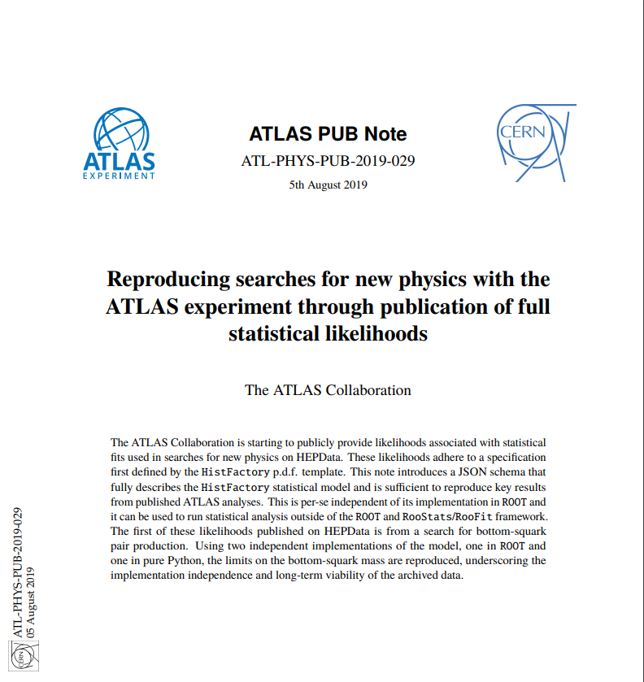](https://cds.cern.ch/record/2684863)
([ATLAS, 2019](https://cds.cern.ch/record/2684863))
]
.kol-1-2.center.width-100[
  
[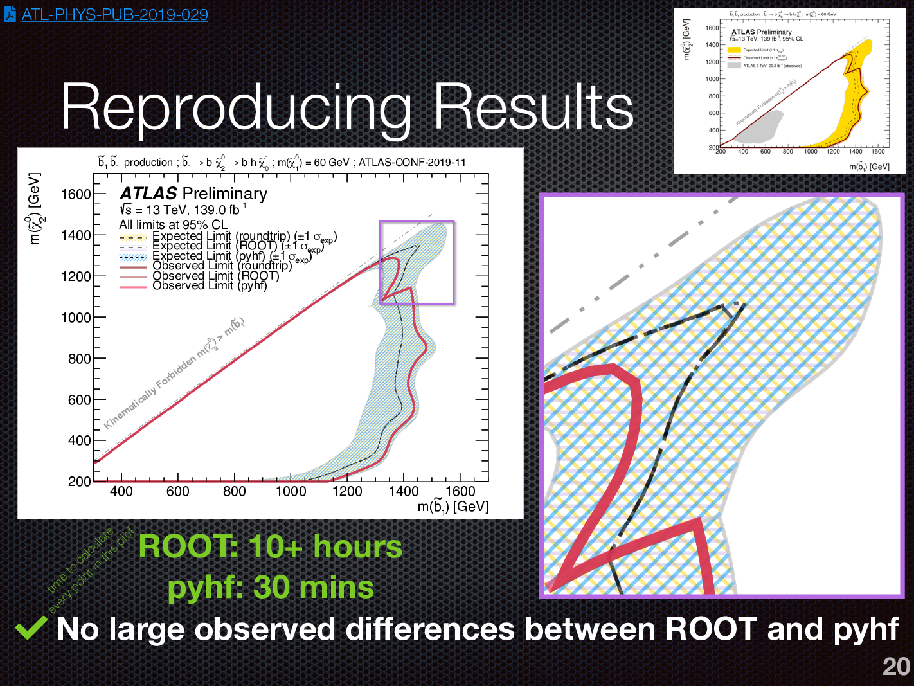](https://indico.cern.ch/event/782953/contributions/3462560/)

Given at [DPF 2019 by Giordon Stark](https://indico.cern.ch/event/782953/contributions/3462560/)
]

---
# Roadmap (Issue [#561](https://github.com/diana-hep/pyhf/issues/561))

Loosely follow [Seibert’s Heirarchy of Needs](https://twitter.com/FRoscheck/status/1159158552298229763)

.center.width-80[]
.center[Stan Seibert (Anaconda) at SciPy 2019]

---
# Roadmap

.center.width-100[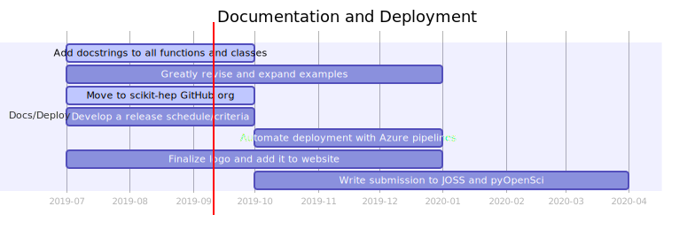]

- Most common question/request core devs get over email is for examples

.center[Gantt Color Key]
.center.width-100[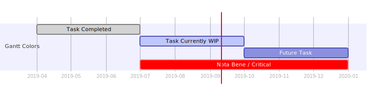]

---
# Roadmap

.center.width-100[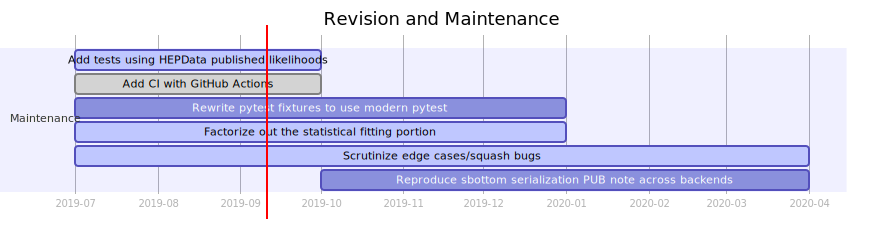]

- Now that we have published likelihoods important to integrate them into testing
- Good opportunity to examine real physics case performance of all backends
- Update testing framework to take advantage of continued improvements
- With addition of [GitHub Actions CI](https://github.com/diana-hep/pyhf/actions) and Henry's use of Azure Pipelines for deployment reconsidering continued use of Travis CI
   - Probable to drop CI in Travis but keep CD with Travis in near future

---
# Roadmap
<!--  -->
.center.width-95[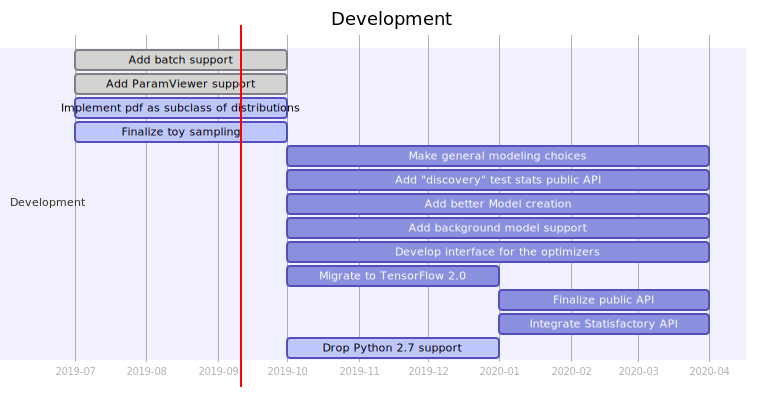]
<!--  -->
- Clear, reliable public API
- Toys for when asymptotics fail in low stats regime
   - Most requested feature
- Statisfactory and [zfit](https://github.com/zfit/zfit/issues/120) integrations

---
# Roadmap

.center.width-100[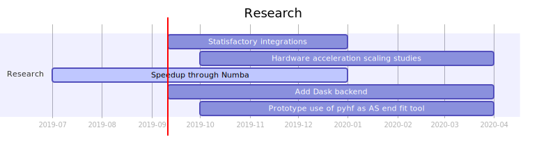]

.kol-1-2[
- Hardware acceleration and scaling studies highly important
- Access to [Hardware-Accelerated Learning (HAL)](https://wiki.ncsa.illinois.edu/display/ISL20/HAL+cluster) at NCSA at Illinois
   - Ideal cluster for benchmarking scaling and performance
- Scaling with Dask could add additional benefit
]
.kol-1-2[
.center.width-90[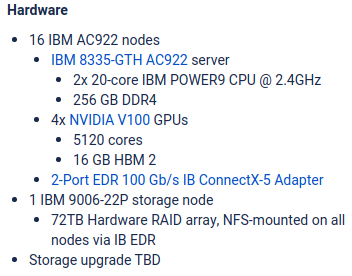]
]

---
# Roadmap + Analysis Systems

.center.width-90[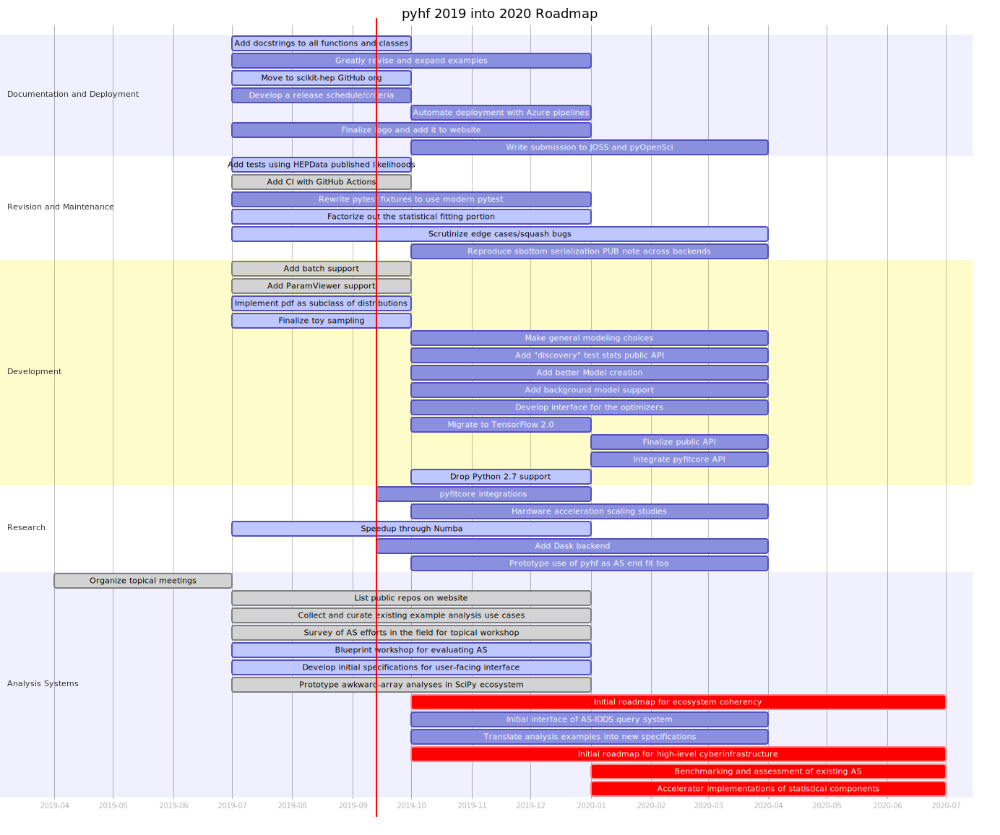]

---
# Analysis Systems Milestones

.center.width-105[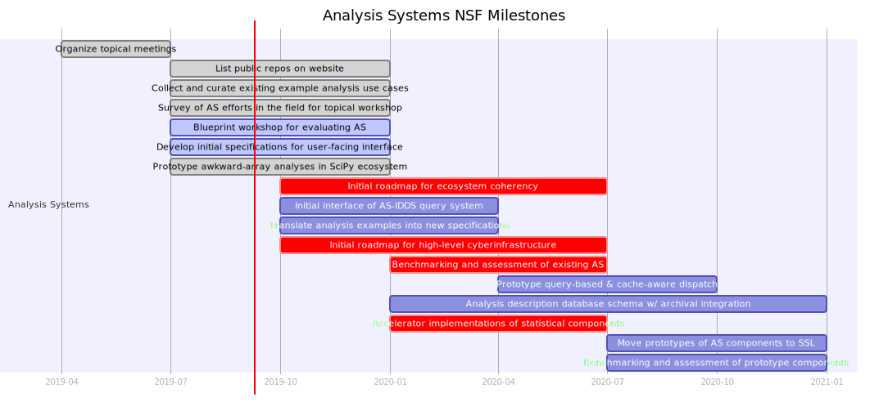]

- Initial roadmap for ecosystem coherency (2019-Q4 -> 2020-Q3)
- Initial roadmap for high-level cyberinfrastructure (2019-Q4 -> 2020-Q3)
- Benchmarking and assessment of existing AS (2020-Q1 -> 2020-Q3)
- Accelerator implementations of statistical components  (2020-Q1 -> 2020-Q3)

---
# Initial roadmap for ecosystem coherency
<!--  -->
.center.width-100[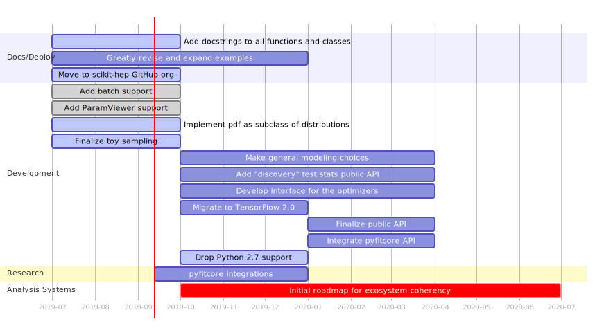]
<!--  -->
- Statisfactory integration and stable API critical

---
# Initial roadmap for high-level cyberinfrastructure

.center.width-100[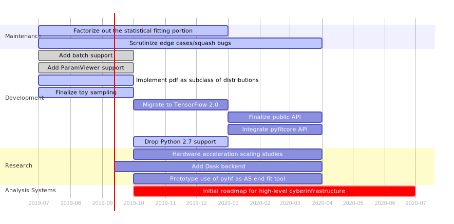]

- Fitting as a service on a cluster
- Similar idea to [ATLAS ML Platform](https://www.atlas-ml.org) (IRIS-HEP SSL) but for fits

---
# Benchmarking and assessment of existing AS

.center.width-100[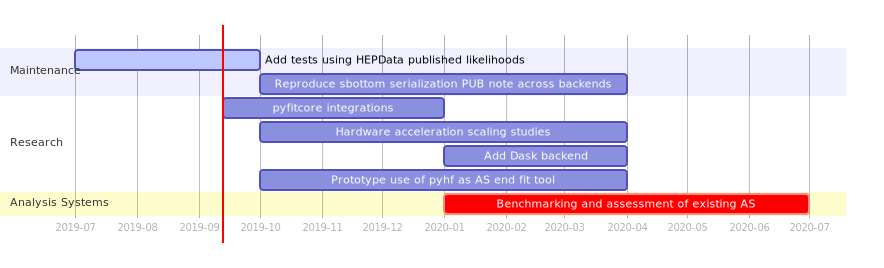]

- Case study: Use pyhf in concert with other parts of AS to replicate entire ATLAS analysis (DAOD -> plot)
- Proposal: Matthew's thesis analysis ([ATLAS-CONF-2018-052](http://inspirehep.net/record/1705606/))

---
# Accelerator implementations of statistical components

.center.width-100[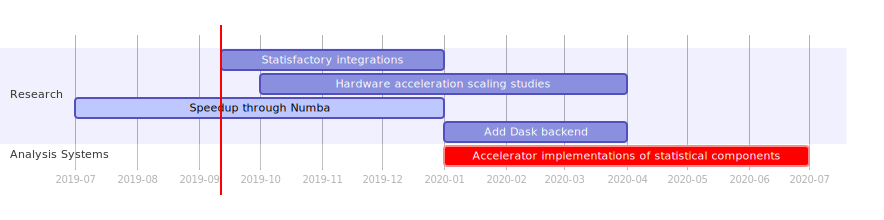]

- Given pyhf research goals should be well on track

---
# Upcoming Release v0.1.3

## Toy Sampling

.kol-1-2.center.width-95[
[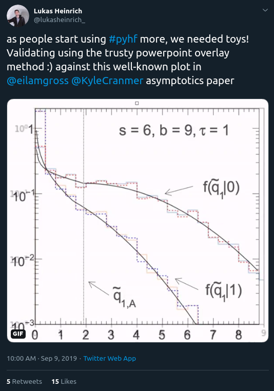](https://twitter.com/lukasheinrich_/status/1171075909102833665)
]
.kol-1-2.width-100[
.center[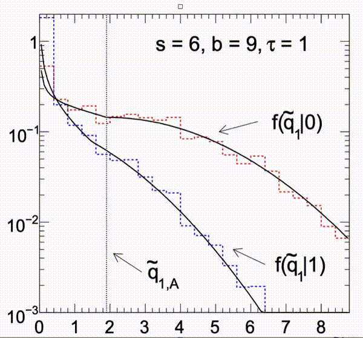]

In just a few lines of code are able to reproduce Figure 5b of [arXiv:1007.1727](https://inspirehep.net/record/860907)! 👍
]

---
# ...in just a few lines

.center.width-80[
<!--  -->
[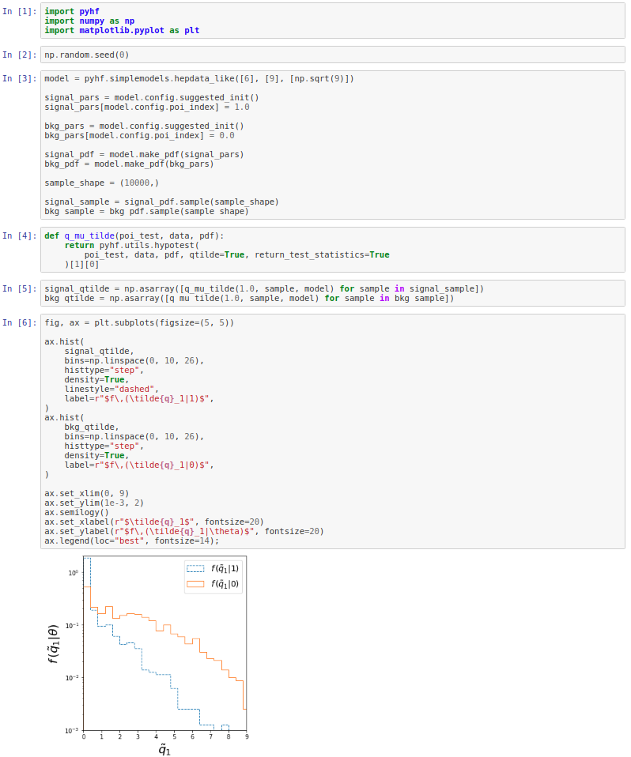](https://mybinder.org/v2/gh/matthewfeickert/talk-IRIS-HEP-Institute-Retreat-2019/master?filepath=notebooks%2Ftoys-example.ipynb)
]

---
# Summary

- pyhf development roadmap laid out for rest of the year
- Institute retreat is well needed ground for discussions on pyhf in Statisfactory
   - Discussions here will be critical for API design
- Discussions on alignment with Analysis Systems milestones important for roadmap changes
<!--  -->
.center.width-90[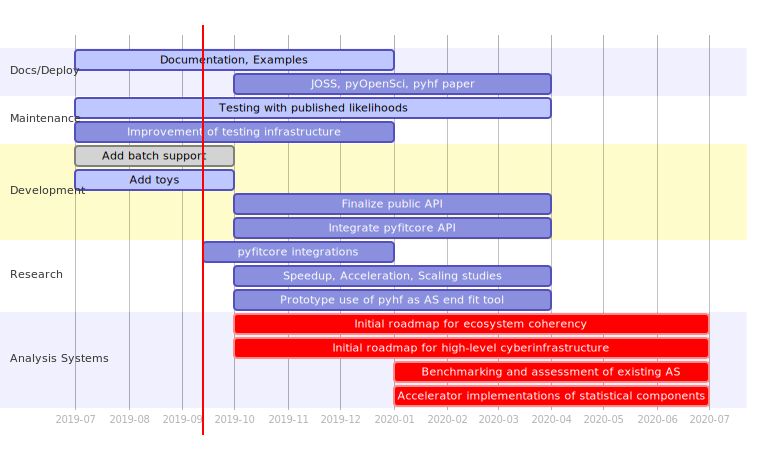]

---
class: end-slide, center

Backup

---
# Backup Slide

.bold[Recent Talks:]
- [Poster at SciPy 2019](http://conference.scipy.org/proceedings/scipy2019/slides.html) (July, 8-14th, 2019)

.bold[Upcoming Talks:]
- [Talk at PyHEP 2019](https://indico.cern.ch/event/833895/) (October 16-18th, 2019)
- [Talk at CHEP 2019](https://indico.cern.ch/event/773049/contributions/3476143/) (November 4-8th, 2019)
- [Poster at CHEP 2019](https://indico.cern.ch/event/773049/contributions/3476180/) (November 4-8th, 2019)

---
# References

1. ROOT collaboration, K. Cranmer, G. Lewis, L. Moneta, A. Shibata and W. Verkerke, .italic[[HistFactory: A tool for creating statistical models for use with RooFit and RooStats](http://inspirehep.net/record/1236448)], 2012.
2. L. Heinrich, H. Schulz, J. Turner and Y. Zhou, .italic[[Constraining $A_{4}$ Leptonic Flavour Model Parameters at Colliders and Beyond](https://inspirehep.net/record/1698425)], 2018.

---

class: end-slide, center
count: false

The end.
